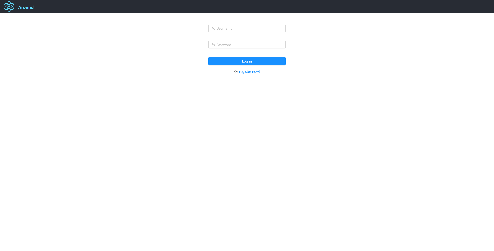

# Circle: A Cloud And React Based Social Networking

## Introduction
https://prod.d3omump6xs0uly.amplifyapp.com

This project is a webpage that allows users to share and explore posts from nearby positions. Users can upload posts with pictures and videos. The project is deployed on **AWS** and **GCE**.

The front-end is written using **react** and the back-end is written using **go**

The user can login with his/her username and password, and can find all posts around the user.

## Display and Functionality

### Login/Register
Login page

  

Register page

  

If the password and username pass validation, the check box will automatically turn green, otherwise will indicate something is wrong

  

  

### Image/Video Posts

Image posts

  

Video posts

  

### Map

Users can view posts on map. The red one indicates a image posts and a blue one indicate a video post.
User can click on marker and view the posts.

  

  

### Create Posts

  

### Check posts with face in them

  

## Backend

### Google VM instance

### Storage
